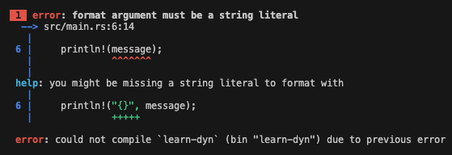
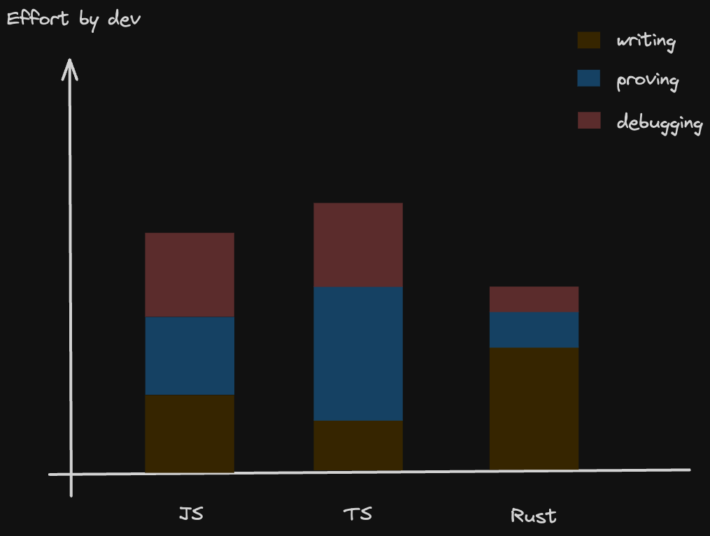

[](https://www.rust-lang.org/)

<br>

API Days Paris - Zacaria Chtatar - December 2023

https://havesome-rust-api-day.surge.sh

note:

Started dev and JS 10 years ago
And I love it
I love the fact that you can move quickly
The fact that you can use it everywhere
And that's the richest ecosystem ever

---

Forget TypeScript <!-- .element: class="fragment" data-fragment-index="1" -->

Choose Rust to build <!-- .element: class="fragment" data-fragment-index="2" -->

Robust, Fast and Cheap APIs <!-- .element: class="fragment" data-fragment-index="3" -->

note:

But today I'm going to suggest you to

Forget Typescript and choose Rust to build your Robust, fast, and cheap APIs

It's not a tutorial, I'll try to give maximum elements to help guide your decision making.

I'll introduce you to Rust by being as less technical as possible.

---

## Some context

----

### 2009

JS lives in the browser


note:

2009 : it's jQuery era JS lives mainly in the browser. It's used to make animations and async requests

----

### Until Nodejs

V8 engine, modules system & NPM


- modules
- boom of easy to reuse code
- fullstack JS : Easy to start with, hard to master

note:

Some bright people decided to extract Chrome's JS VM to run JavaScript outside the browser
With this, they created JS modules systems

Suddenly, it became really easy to reuse and build upon JS code.

The abstraction was so powerfull that it created a rich ecosystem where JS was a must learn language

Frontend became so complicated that we separated Frontend and Backend.

----

### Fullstack developers

- paradigm clash
- hard to sync changes between frontend and backend

note:

Often separated by an API

Then we merged them again to create the super fullstack developers

But the Java, dotNet, statically typed developers

Hurt themselves to the powerful yet dangerous JavaScript.

The feeling of safety was no more.

Especially when trying to integrate static typed backends the dynamically typed frontend.

----

### Typescript


- OOP patterns
- compiler checks
- type system
- IDE Developer experience

note:

So TypeScript came as a superset. Bringing types, checks and better code discoverability. overall better developer experience

The greed, we can all be guilty of, can even let us build a complete typed sidesystem around our functionalities.

Costing time and effort just to please the compiler. Don't even ask to change a type deeply buried into layer of inheritance or other abstractions.

Unfortunately, what TS brings fades just after the compilation.

Types, classes, interfaces are gone.

At 4am when problems wake you up, it's JavaScript that you have to deal with.

----

## Pain points

- types disappear at runtime
- does not save you from dealing with JS
- adds complexity
- no semver

**JSDoc is enough to get max value without overhead** <!-- .element: class="fragment" data-fragment-index="1" -->

note:

no semver is quite important

It's a way to synchronize with the ecosystem.

It's not normal to have breaking changes in minor version bumps.

And it feels strange to have to point it out

---

### New stakes, new needs


note:

All of this has a purpose

The more technology enters inside our society, the more it becomes sensitive

At first it was on optional boost to our lives

----

|Stakes| Needs|
|-------|-------|
|worldwide scale<br>privacy<br>market competition<br>environment<br><br>human lives|sclability<br>security<br>functionality <br>computation time<br>memory footprint<br>safety|

note:

Now it's an essential part, the stakes are pretty serious

I believe for such use cases, TypeScript is not enough

safety :  refers to the ability of a system to operate without causing harm or unintended consequences to people or the environment. It's about the system's internal behavior and its impact. The system needs to be fault tolerant
security : protecting systems from malicious attacks and unauthorized access. It's about external threats and the system's ability to defend against them.

---

## Introducing Rust

_Fast, Reliable, Productive: pick three._

---

## Stability

----


note:

When a value is unexpectedly null or undefined
That's an unvalid state
As a system programing language, Rust makes it easy to make invalid state unrepresentable

----

What's wrong with this code ?

```ts
function readFile(path: string): string {
  return fs.readFileSync(path);
}
```

note:

There is no hint that this could break under some conditions

Not in the interface, nor in the code

----

```rust
fn read_file(path: &str) -> Result<String, io::Error> {
    fs::read_to_string(path)
}
```

```rust
fn read_file(path: &str) -> String {
    fs::read_to_string(path).unwrap()
}
```

Clarify what could go wrong

----

2016 : Do you remember the [left-pad drama](https://qz.com/646467/how-one-programmer-broke-the-internet-by-deleting-a-tiny-piece-of-code) ?


[Source](https://www.explainxkcd.com/wiki/index.php/2347:_Dependency)

----

### crates.io

- no crate (package) unpublish
- can disable crate only for new projects

note:

cargo does not allow unpublishing
Instead it allows flagging packages and version to not be downloaded as new dependency

----

Linux: [The Kernel](https://linux.developpez.com/actu/337316/Rust-for-Linux-est-officiellement-fusionne-le-support-initial-de-Rust-for-Linux-fournit-l-infrastructure-de-base-et-une-integration-elementaire/)


- 2/3 of vunerabilities come from memory management <!-- .element: class="fragment" data-fragment-index="1" -->
- Kernel is in C and Assembly <!-- .element: class="fragment" data-fragment-index="2" -->
- Linus Torvalds : ❌ C++ ❌ <!-- .element: class="fragment" data-fragment-index="3" -->
- attract young devs <!-- .element: class="fragment" data-fragment-index="4" -->

note:

Let's take an example of someone who is famously hard to please in terms of code.

To continue development after C, has started using Rust, as well as Microsoft for Windows and Google for Android

<!-- - Linux project
- [Microsoft](https://msrc.microsoft.com/blog/2019/07/a-proactive-approach-to-more-secure-code/) project -->

---

## Fast

----


note:

[Energy efficiency accross programing languages](https://greenlab.di.uminho.pt/wp-content/uploads/2017/10/sleFinal.pdf)

Energy measured using a framework (Computer Language Benchmarks Game) designed for running testing and comparing solutions to problems

And Intel's Running Average Power Limit (RAPL) tool which can measure energy consumption of an executed program.

----

#### Github: [Code Search index](https://github.blog/2023-02-06-the-technology-behind-githubs-new-code-search/)


45 million repos to index : <!-- .element: class="fragment" data-fragment-index="1" -->

- several months with Elasticsearch <!-- .element: class="fragment" data-fragment-index="2" -->
- 18h in Rust <!-- .element: class="fragment" data-fragment-index="3" -->

----

#### Cloudflare: [HTTP proxy](https://blog.cloudflare.com/how-we-built-pingora-the-proxy-that-connects-cloudflare-to-the-internet/)


- nginx not fast enough 🤯 <!-- .element: class="fragment" data-fragment-index="1" -->
- hard to customize in C <!-- .element: class="fragment" data-fragment-index="2" -->
- allows to share connections between threads <!-- .element: class="fragment" data-fragment-index="3" -->

= 160x less connections to the origins <!-- .element: class="fragment" data-fragment-index="4" -->

= 434 years less handshakes per day <!-- .element: class="fragment" data-fragment-index="5" -->

----

#### Discord: [Message read service](https://discord.com/blog/why-discord-is-switching-from-go-to-rust)


- Cache of a few billion entries <!-- .element: class="fragment" data-fragment-index="1" -->
- Every connection, message sent and read... <!-- .element: class="fragment" data-fragment-index="2" -->
- latences every 2 minutes because of Go Garbage collector <!-- .element: class="fragment" data-fragment-index="3" -->

 <!-- .element: class="fragment" data-fragment-index="4" -->

note:

Thanks to no GC
Instead of stopping the world to clean unused memory
Every variable is cleaned at a precise moment
For the devs, that's the purpose of ownership

---

## Cheap

----


note:

- CPU and RAM consumption

- Less maintenance with less bugs

[Energy efficiency accross programing languages](https://greenlab.di.uminho.pt/wp-content/uploads/2017/10/sleFinal.pdf)

Energy measured using a framework (Computer Language Benchmarks Game) designed for running testing and comparing solutions to problems

And Intel's Running Average Power Limit (RAPL) tool which can measure energy consumption of an executed program.----

### AWS Lambda

- [Firecracker](https://firecracker-microvm.github.io/)

---

### Sexy

<ul>
<li class="fragment" data-fragment-index="1">Most admired language according to  <a href="https://survey.stackoverflow.co/2023/#section-admired-and-desired-programming-scripting-and-markup-languages">StackOverflow</a> for 8 years !</li>
<li class="fragment" data-fragment-index="2">JS meetups: people talking about Rust </li>
<li class="fragment" data-fragment-index="3">More devs available than offers </li>
<li class="fragment" data-fragment-index="4">Web3 projects </li>
</ul>

note:

There is currently a high entry barrier in this domain.

Most of Rust projects require senior C++ dev

Otherwise there are  risking yourself into volatile Web3 projects

From my perspective that's a good recruitment argument

As a more difficult than average technology
By recruiting Rust developers you get higher than average devs
Rust teachings can be used even outside of the language

----

### It's a challenge
 
- It takes 3 to 6 months to become productive

- It's not **that** hard, it's just different

- Documentation was oriented towards C/C++ devs

note:

[Study](https://blog.rust-lang.org/2020/12/16/rust-survey-2020.html)

As a manager recruiting someone who successfully went through the process of learning Rust

It's a safe bet on the technical aspect

---

### Features

- compiled
- no GC
- compiler developed in Rust
- low and high level : compilation with zero cost abstraction
- no manual memory management : Ownership & Borrow checker

=> There is no blackbox between you and the machine <!-- .element: class="fragment" data-fragment-index="1" -->

=> Better predictability <!-- .element: class="fragment" data-fragment-index="2" -->

note:

- compiled : so it produces a specific output for each architecture
- no GC : memory is managed via a deterministic system called Borrow checker
- compiler developed in Rust: you can always go look and see what happens, it's very well explained
- zero cost high level functions like map or filter are compiled to the same output as imperative loops
- As a side effect, the high level languages devs get closer to the machine and get better at writing correct code
- Developers do the memory management by themselves, but now are guided by the rules of the compiler

----

### Ownership rules

- Only one variable owns data at a time  <!-- .element: class="fragment" data-fragment-index="1" -->
- Multiple readers or one editor <!-- .element: class="fragment" data-fragment-index="2" -->

=> Memory is freed as soon as variable is out of scope<!-- .element: class="fragment" data-fragment-index="3" -->

**It's like a fundamental problem has been solved**<!-- .element: class="fragment" data-fragment-index="4" -->

note:

pas de pause

pas de GC

pas de référence vers rien, pas de undefined

----

### Borrow checker 

guarantees by default:

- No memory leaks
- No use-after-free
- No dangling pointers
- Runtime type system

note:

The borrow checker is the system that enforces the rules of ownership

---

### The compiler ❤️

<span class="fragment" data-fragment-index="1">

```rust
fn say(message: &str) {
    println!(message);
}

fn main() {
    let message = "hey";
    say(message);
}
```
</span>

 <!-- .element: class="fragment" data-fragment-index="2" -->

----
### The compiler ❤️

<span class="fragment" data-fragment-index="1">

```rust
fn say(message: String) {
    println!("{}", message);
}

fn main() {
    let message = String::from("hey");
    say(message);
    say(message);
}
```
</span>

 <!-- .element: class="fragment" data-fragment-index="2" -->

note:

This kind of hints are everywhere, not only for simple hello world examples

---

### Installation process

`curl --proto '=https' --tlsv1.2 -sSf https://sh.rustup.rs | sh`

----

### Tools

- cargo test : IT, UT
- cargo fmt
- cargo bench
- clippy : lint
- bacon : reload
- rust-analyzer : IDE developer experience

note:

cargo is like npm for NodeJs, it brings almost all the tools you need

There is no debate over which tool, or formatting standard to use

----

#### Cargo doc stays up to date

```rust [|6-7|]
/// Formats the sum of two numbers as a string.
///
/// # Examples
///
/// ```
/// let result = mycrate::sum_as_string(5, 10);
/// assert_eq!(result, "15");
/// ```
pub fn sum_as_string(a: i32, b: i32) -> String { (a + b).to_string() }
```

`cargo doc --open`

note:

coverage
executed during tests
keeps examples up to date

---

## Governance

Rust Project

[Rust Foundation](https://foundation.rust-lang.org/)

Release process

Backward compatibility

Breaking changes are opt-in

note:

If code compiled at some point, it's guaranteed to compile later.

There's a [special project](https://github.com/rust-lang/crater) that runs a large number of packages to look for regressions in the compiler

Breaking changes are opt-in thanks to editions. The same version of Rust can compile different editions. Any crate can specify an edition.

---

### Benefits

When it compiles, it runs <!-- .element: class="fragment" data-fragment-index="1" -->

correctly <!-- .element: class="fragment" data-fragment-index="2" -->

note:

It seems evident, but is it ?

What does correctly mean ?

- predictable : it always does what you expect it to do
- the error paths are handled or intentionnaly not handled
- secure
- scales

----



note:
Usually you spend 50% of efforts writing and 50% proving the code works

Proving includes Unit tests, Integration tests, with a QA
or in production ...

The problem with TypeScript is that it gives the illusion you're now at 75/25 of writing vs proving
But you are not.

TS lets you write code faster, but it's still 50/50 because of the types getting in your way

Most of the time it's ok, because we want to move fast. And the drawbacks are not that big.
We just need to be aware of it.

So the compiler and the particular syntax checks a ton of problems

---

### Possible struggles

- Project moves slower
- It's an other paradigm
- Challenging to learn
- Build time
- work with external libraries

note:

Moving slower and safer for projects with high stakes, is not necessarily a bad thing when this ensures less bugs after release

It's a paradigm that really empowers developers even when using other languages. It touches fundamentals of software engineering

It was challenging to me. But lately I find more and more resources I wish I had when I started.
So today I feel like it's not that hard anymore. Espceially with ChatGPT and Copilot.
I'll leave some links in the end and you can come to me, or even leave a tweet if you're interested

Integrating libraries often involves complying with layers of abstraction.
When learning and errors occur, the pile of abstraction can make it hard to understand, what the interface wants from us.
Then the source code is Rust, and often well documented, function by function.
So you can always find a solution

---

### Get started as manager

- find dev interested in Rust: there are a lot
- start with simple projects:
  - CLI
  - lambdas
  - microservice
  - network app
  - devops tools

---

### Get started as dev

- [Rust book](https://doc.rust-lang.org/book/)
- [Rust by example](https://doc.rust-lang.org/stable/rust-by-example/)
- [Rustlings](https://github.com/rust-lang/rustlings)
- [Comprehensive Rust by Google](https://google.github.io/comprehensive-rust/)
- [fasterthanlime - A half-hour to learn Rust](https://fasterthanli.me/articles/a-half-hour-to-learn-rust)
- [Noboilerplate - Youtube](https://www.youtube.com/c/NoBoilerplate)
- [Code to the moon - Youtube](https://www.youtube.com/@codetothemoon/videos)
- [Roadmap](https://roadmap.sh/rust)
- lets get rusty

---

### "When and Where"

----


[Source](https://www.youtube.com/watch?v=Wy-y75mMRg4)

note:

let's conclude with this chart

It has been drawn by a software enginner named theo, which focus is building things as fast as possible, to quickly achieve product market fit.

theo explains accurately that lots of projects starting don't know what they will look like in the end

So it's better to start using the most flexible tools in order to pivot easily.

At this point just use flexible stacks like typescript and abstract problems using ready to go services

But when the project finds its way, then the new need is performance and stability over flexibility

And Rust is perfect at this job

You can rewrite now and have it run for years without problems. And whenever you come back with some new features.

You'll integrate them with the confidence that you won't break things.

---

## Q&A

---

### Thank you


