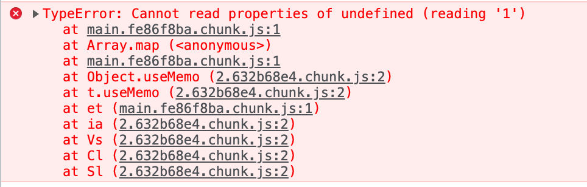
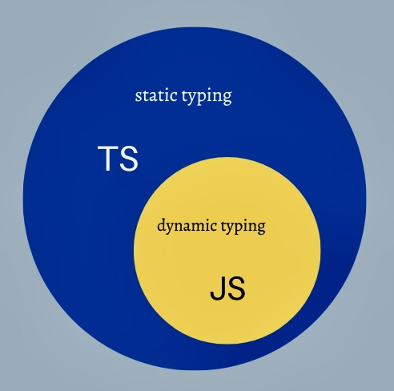
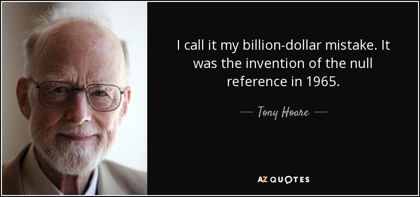
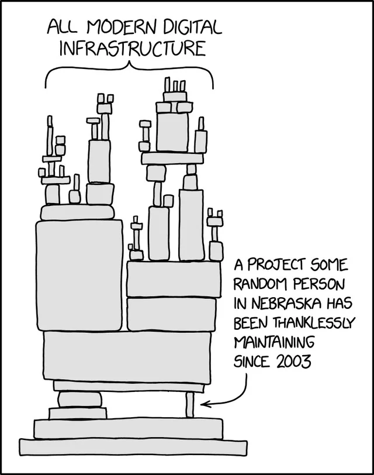
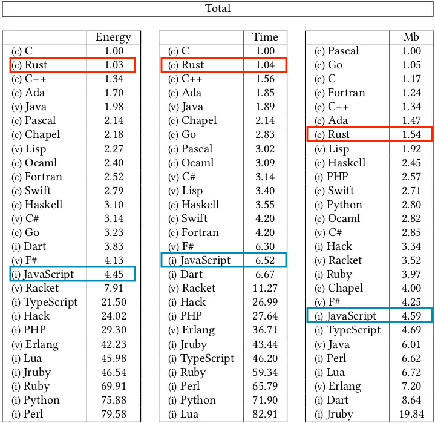
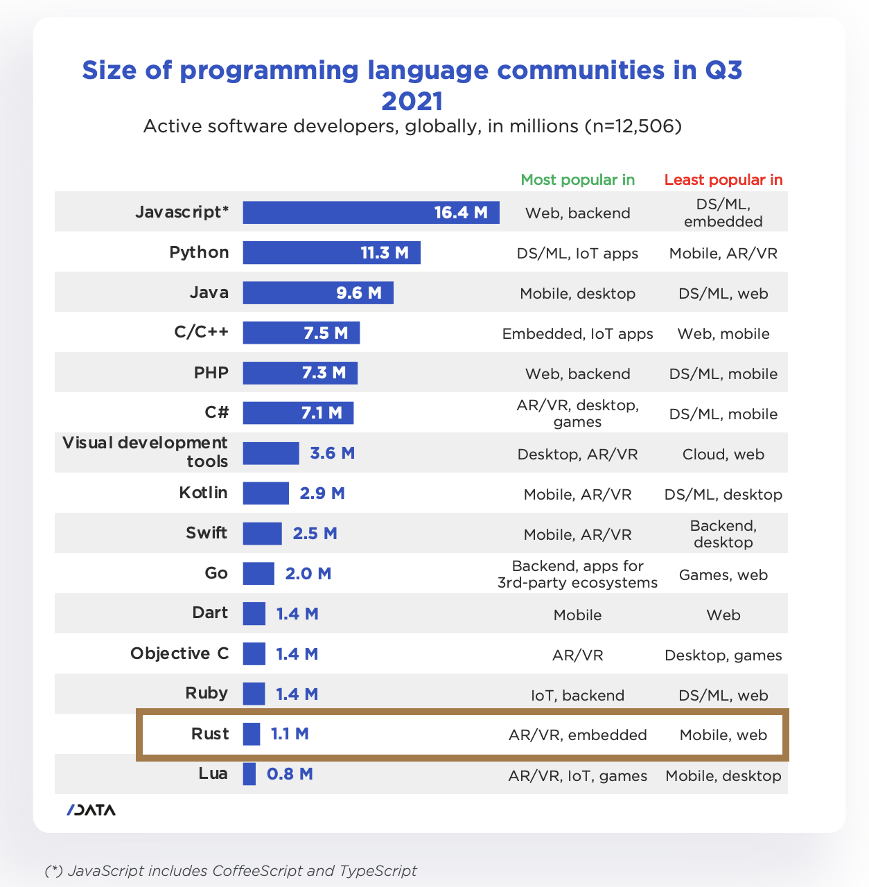
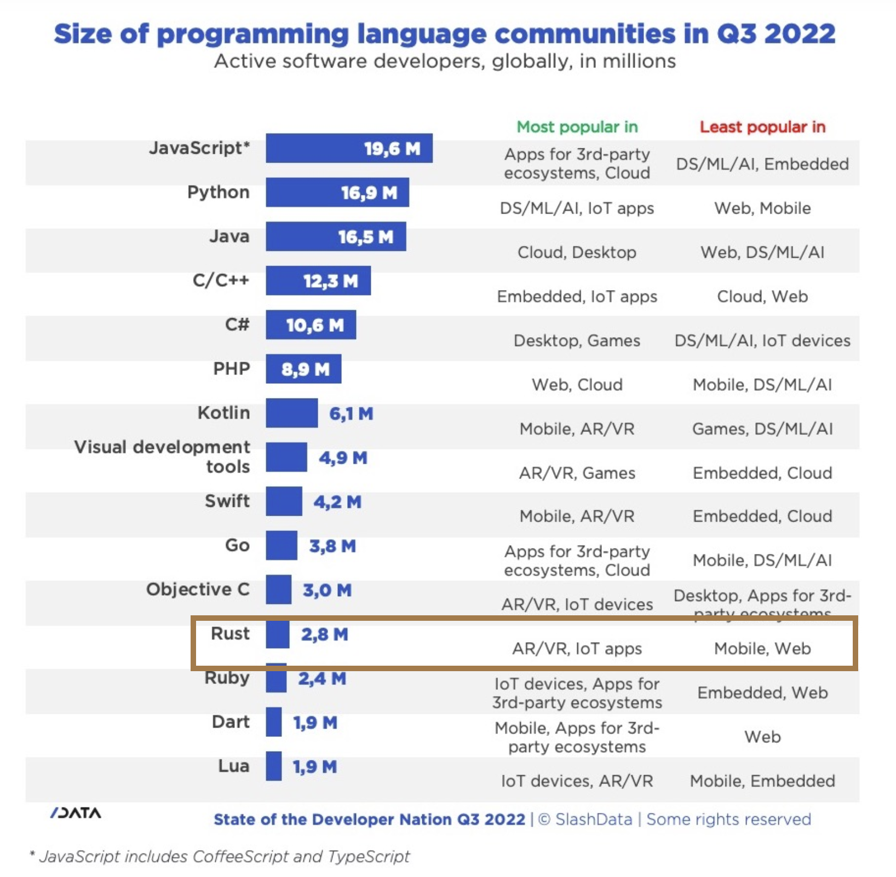
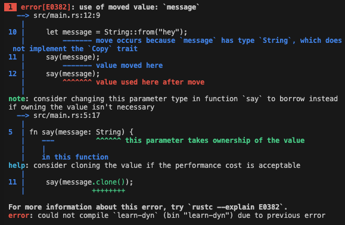
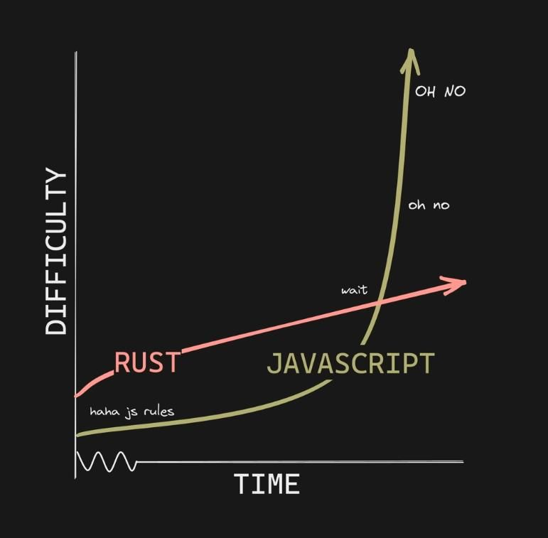
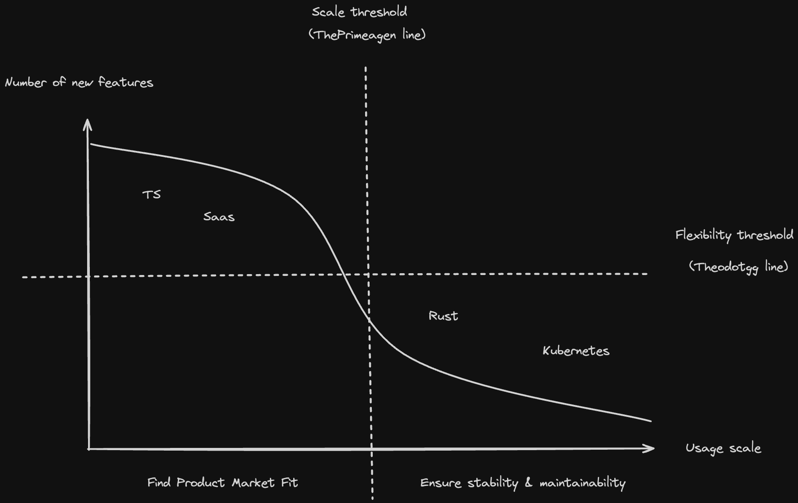

#### API Days Paris

<br>

[](https://www.rust-lang.org/)

<br>


Zacaria Chtatar - December 2023

https://havesome-rust-apidays.surge.sh

note:

Started development and JS 10 years ago

And I love it

I love the fact that you can move quickly

The fact that you can use it everywhere

And that's the richest ecosystem ever

Today I'm building ClubMediterranee API in NodeJS

But I'm here to express my own opinions which do not necessarily reflect those of ClubMediterranee

---

### Forget TypeScript <!-- .element: class="fragment" data-fragment-index="1" -->

### Choose Rust <!-- .element: class="fragment" data-fragment-index="2" -->

#### to build <!-- .element: class="fragment" data-fragment-index="3" -->

### Robust, Fast and Cheap APIs <!-- .element: class="fragment" data-fragment-index="4" -->

note:

But today I'm going to suggest you to

Forget TypeScript and choose Rust to build your Robust, fast, and cheap APIs

It's not a tutorial, I'll try to give maximum elements to help guide your decision making.

I'll introduce you to Rust by being as less technical as possible.

---

## Some context

----

### 2009

JS lives in the browser


note:

2009 : it's jQuery era JS lives mainly in the browser. It's used to make animations and async requests

----

### Until Nodejs

V8 engine, modules system & NPM


- modules
- boom of easy to reuse code
- fullstack JS : Easy to start with, hard to master

note:

Some bright people decided to extract Chrome's JS VM to run JavaScript outside the browser
With this, they created JS modules systems

Suddenly, it became really easy to reuse and build upon JS code.

The abstraction was so powerfull that it created a rich ecosystem where JS was a must learn language

----

### Fullstack

- paradigm clash between static and dynamic
- JS doesn't help you follow strict API interfaces

 <!-- .element: class="fragment" data-fragment-index="1" -->

note:

Frontend became so complicated that we separated Frontend and Backend using APIs.

Then we merged the subject again to create the fullstack word

But the Java, dotNet developers trying to create frontend in JS with static type mindsent didn't work well

Because in fact JavaScript doesn't help you follow strict interfaces

The feeling of safety was no more.

----

### TypeScript



Benefits:
- IDE Developer experience
- OOP patterns
- compiler checks
- type system

=> better management of big codebase <!-- .element: class="fragment" data-fragment-index="1" -->

note:

So TypeScript came as a superset of javascript. Bringing types, checks and better code discoverability. overall better developer experience

The problem is that often, project teams build a complete sidesystem of types around the functionalities.

Costing time and effort just to please the compiler.

Don't even ask to change a type deeply buried into layer of inheritance or other abstractions.

Unfortunately, what TS brings fades just after the compilation.

Types, classes, interfaces are gone.

At 4am when problems wake you up, it's JavaScript that you have to deal with.

----

### Pain points

- does not save you from dealing with JS
- adds types management
- adds static layer onto dynamic layer

**JSDoc answers to the precise problem of hinting types without getting in your way** <!-- .element: class="fragment" data-fragment-index="1" -->

---

### New stakes, new needs


note:

All of this has a purpose

The more technology enters inside our society, the more it becomes sensitive

At first it was on optional boost to our lives

----

|Stakes| Needs|
|-------|-------|
|worldwide scale<br>privacy<br>market competition<br>environment<br><br>human lives|scalability<br>security<br>functionality <br>computation time<br>memory footprint<br>safety|

<br>

#### TypeScript is not enough <!-- .element: class="fragment" data-fragment-index="1" -->

note:

Now it's an essential part and the stakes are pretty serious

I believe for such use cases, TypeScript is not enough

safety :  refers to the ability of a system to operate without causing harm or unintended consequences to people or the environment. It's about the system's internal behavior and its impact. The system needs to be fault tolerant
security : protecting systems from malicious attacks and unauthorized access. It's about external threats and the system's ability to defend against them.

---

## Introducing Rust

_Fast, Reliable, Productive: pick three_

note:

So now, let's talk about Rust

---

## Stable

note:

The consistency of integrating NodeJS modules enabled the boom of all the frontend applications we know today

I believe that ultra stability of backend APIs will enable an other leap for our society

----



note:

Let's bring again the billion dollar mistake. We need the idea of nothing

But when a value is unexpectedly null or undefined.

That's an invalid state, and we do not need this.

----

### enums

```rust
// full code of the solution to the billion dollar mistake
// included in the standard library
enum Option<T> {
    None,
    Some(T),
}
```

```rust
let item: Option<Item> = get_item();

match item {
    Some(item) => map_item(item),
    None => handle_none_case(), // does not compile if omitted
}
```

note:

Instead, use the Option enum to represent the idea of nothing

And the compiler will make sure you don't forget to handle this case

----

```rust
struct FakeCat {
    alive: bool,
    hungry: bool,
}

let zombie = FakeCat { alive: false, hungry: true }; // ???

```

<blockquote class="fragment" data-fragment-index="1">
Rust makes it easy to make invalid state unrepresentable with enums
</blockquote>

<span class="fragment" data-fragment-index="2">

```rust
enum RealCat {
    Alive { hungry: bool }, // enums can contain structs
    Dead,
}
```
</span>

note:

In other languages we should implement getters, setters and think of absurd cases to protect the system from invalid states

----

What's wrong with this TS snippet ?

```ts
function readFile(path: string): string {
  return fs.readFileSync(path);
}
```

note:

There is no hint that this could break under some conditions

Not in the interface, nor in the code

----

```rust
fn read_file(path: &str) -> Result<String, io::Error> {
    fs::read_to_string(path)
}
```

```rust
fn read_file(path: &str) -> String {
    fs::read_to_string(path).unwrap()
}
```

We need to clarify what could go wrong <!-- .element: class="fragment" data-fragment-index="1" -->

It's even better when it's embedded in the language <!-- .element: class="fragment" data-fragment-index="2" -->

----

2016 : Do you remember the [left-pad drama](https://qz.com/646467/how-one-programmer-broke-the-internet-by-deleting-a-tiny-piece-of-code) ?



[Source](https://www.explainxkcd.com/wiki/index.php/2347:_Dependency)

----

### crates.io

- no crate (package) unpublish
- can disable crate only for new projects

note:

cargo does not allow unpublishing
Instead it allows flagging packages and version to not be downloaded as new dependency

----

Linux: [The Kernel](https://linux.developpez.com/actu/337316/Rust-for-Linux-est-officiellement-fusionne-le-support-initial-de-Rust-for-Linux-fournit-l-infrastructure-de-base-et-une-integration-elementaire/)


- attract young devs <!-- .element: class="fragment" data-fragment-index="1" -->
- 2/3 of vunerabilities come from memory management <!-- .element: class="fragment" data-fragment-index="2" -->
- Kernel is in C and Assembly <!-- .element: class="fragment" data-fragment-index="3" -->
- Linus Torvalds : C++ 🙅‍♂️  <!-- .element: class="fragment" data-fragment-index="4" -->

note:

Let's take an example of someone who is famously hard to please in terms of code.

To attract youg developers and to solve memory vulnerabilities, Linus has started using Rust, as well as Microsoft for Windows and Google for Android

That's a big sign of trust towards the whole ecosystem

- [Microsoft](https://msrc.microsoft.com/blog/2019/07/a-proactive-approach-to-more-secure-code/)

---

## Fast

----



[2017 : Energy efficiency accross programing languages](https://greenlab.di.uminho.pt/wp-content/uploads/2017/10/sleFinal.pdf)

note:

Energy measured using a framework (Computer Language Benchmarks Game) designed for running testing and comparing solutions to problems

And Intel's Running Average Power Limit (RAPL) tool which can measure energy consumption of an executed program.

----

#### Github: [Code Search index](https://github.blog/2023-02-06-the-technology-behind-githubs-new-code-search/)


45 million repos

28 TB of unique content


- several months with Elasticsearch <!-- .element: class="fragment" data-fragment-index="1" -->
- 36h with Rust and Kafka <!-- .element: class="fragment" data-fragment-index="1" -->
- 640 queries /s <!-- .element: class="fragment" data-fragment-index="1" -->

----

#### Cloudflare: [HTTP proxy](https://blog.cloudflare.com/how-we-built-pingora-the-proxy-that-connects-cloudflare-to-the-internet/)


- nginx not fast enough 🤯 <!-- .element: class="fragment" data-fragment-index="1" -->
- hard to customize in C <!-- .element: class="fragment" data-fragment-index="2" -->
- allows to share connections between threads <!-- .element: class="fragment" data-fragment-index="3" -->

= 160x less connections to the origins <!-- .element: class="fragment" data-fragment-index="4" -->

= 434 years less handshakes per day <!-- .element: class="fragment" data-fragment-index="5" -->

----

#### Discord: [Message read service](https://discord.com/blog/why-discord-is-switching-from-go-to-rust)


- cache of a few billion entries <!-- .element: class="fragment" data-fragment-index="1" -->
- every connection, message sent and read... <!-- .element: class="fragment" data-fragment-index="2" -->
- latences every 2 minutes because of Go Garbage collector <!-- .element: class="fragment" data-fragment-index="3" -->

 <!-- .element: class="fragment" data-fragment-index="4" -->

note:

better on every metric

Thanks to no GC

Instead of stopping the world to clean unused memory

Every variable is cleaned at the precise moment it goes out of scope

---

## Cheap

----


- cpu & memory
- less bugs
- learning curve
- less cases to test

note:

- CPU and RAM consumption

- less maintenance with less bugs

- the learning curve is steep in the beginning, but then it tends to get easier.

[Energy efficiency accross programing languages](https://greenlab.di.uminho.pt/wp-content/uploads/2017/10/sleFinal.pdf)

Energy measured using a framework (Computer Language Benchmarks Game) designed for running testing and comparing solutions to problems

And Intel's Running Average Power Limit (RAPL) tool which can measure energy consumption of an executed program

---

### Attractive

<!-- <ul> -->
<span class="fragment" data-fragment-index="1">Most admired language according to  <a href="https://survey.stackoverflow.co/2023/#section-admired-and-desired-programming-scripting-and-markup-languages">StackOverflow</a> for 8 years !</span>

<span class="fragment" data-fragment-index="3">Only place where there is more devs available than offers </span>
<!-- <li class="fragment" data-fragment-index="4">Web3 projects </li> -->
<!-- </ul> -->

note:

There is currently a high entry barrier in this domain.

Most of Rust projects require senior C++ dev

Otherwise a lot of Web3 projects have put their trust in Rust

From my perspective that's a good recruitment argument

As a more difficult than average technology.

By recruiting Rust developers you get better than average devs as Rust teachings can be used even outside of the language

----

#### Growing community





note:

It also has been the biggest growing community along with Kotlin

https://aws.amazon.com/fr/blogs/opensource/sustainability-with-rust/

https://www.slashdata.co/blog/state-of-the-developer-nation-23rd-edition-the-fall-of-web-frameworks-coding-languages-blockchain-and-more

---

### Features

- static types & inference
- compiled
- no GC
- compiler developed in Rust
- low and high level : zero cost abstraction
- no manual memory management : Ownership & Borrow checker

=> There is no blackbox between you and the machine <!-- .element: class="fragment" data-fragment-index="1" -->

=> Better predictability <!-- .element: class="fragment" data-fragment-index="2" -->

=> Awesome developer experience <!-- .element: class="fragment" data-fragment-index="3" -->

note:

- compiled
- no GC : memory is managed via a deterministic system called Borrow checker
- compiler developed in Rust: you can always go look and see what happens, it's very well explained
- zero cost high level functions like map or filter are compiled to the same output as imperative loops
- As a side effect, the high level languages devs get closer to the machine and get better at writing correct code
- Developers do the memory management by themselves, but now are guided by the rules of the compiler

----

### Ownership rules

- Only one variable owns data at a time  <!-- .element: class="fragment" data-fragment-index="1" -->
- Multiple readers or one writer <!-- .element: class="fragment" data-fragment-index="2" -->

=> Memory is freed as soon as variable is out of scope<!-- .element: class="fragment" data-fragment-index="3" -->

**It's like a fundamental problem has been solved**<!-- .element: class="fragment" data-fragment-index="4" -->

note:

pas de pause

pas de GC

pas de référence vers rien, pas de undefined

----
### The compiler ❤️

<span class="fragment" data-fragment-index="1">

```rust
fn say(message: String) {
    println!("{}", message);
}

fn main() {
    let message = String::from("hey");
    say(message);
    say(message);
}
```
</span>

 <!-- .element: class="fragment" data-fragment-index="2" -->

note:

Let's look at how the compiler guides you

In rust you don't give a reference to a function

You give ownership

Just look at this beautiful error message

It tells you where is the error message

Why is it an error

And even hints you how to solve this

This kind of hints are everywhere, not only for simple hello world examples

Tell me now, who wants to go back to stacktraces ?

----

### Tools

- cargo test : Integration Tests, Unit Ttests
- cargo fmt
- cargo bench
- clippy : lint
- bacon : reload
- rust-analyzer : IDE developer experience

note:

cargo is like npm for NodeJs, it brings almost all the tools you need

There is no debate over which tool, or formatting standard to use

----

#### Cargo doc stays up to date

```rust [|6-7|]
/// Formats the sum of two numbers as a string.
///
/// # Examples
///
/// ```
/// let result = mycrate::sum_as_string(5, 10);
/// assert_eq!(result, "15");
/// ```
pub fn sum_as_string(a: i32, b: i32) -> String { (a + b).to_string() }
```

`cargo doc --open`

note:

This generates a full website documentation

And yes, the test in the comments are compiled

---

### Possible struggles

- projects move slower
- embrace the paradigm
- takes 3 to 6 months to become productive
- build time
- work with external libraries
- ecosystem calmer than JS

note:

Moves slower because you need to make your code correct to compile.

You can easily take shortcuts when developing, but if you're a serious professional.

You will have to remove them before releasing. The good thing is that the shortcuts are obvious in the code.
Like the unwrap function I showed you earlier

An trust me it's not that hard. It's just different.

It was challenging to me. But lately I find more and more resources I wish I had when I started.
So today I feel like it's not that hard anymore. Especially with ChatGPT and Copilot.

Like in TypeScript, integrating libraries often involves complying with layers of abstraction.
When you're learning and errors occur, the pile of abstraction can make it hard to understand, what the interface wants from you.

And this is just a matter of experience in the ecosystem

[Productivity study](https://blog.rust-lang.org/2020/12/16/rust-survey-2020.html)

----

> In other languages simple things are easy and complex things are possible, in Rust simple things are possible and complex things are EASY.



note:

There a few simple things that are complex in the beginning

But you can be assured that the complexity won't go exponential like in JS/TS ecosystem

---

### Project lifetime

----



[Source](https://www.youtube.com/watch?v=Wy-y75mMRg4)

note:

This is projects timelineas been drawn by a software enginner named Theo which also appears on Youtube. He focuses is building things as fast as possible, to quickly achieve product market fit.

His point of view is often opposed to an other guy named ThePrimagean. He focuses on performance and correctness

Theo explains accurately that lots of projects starting don't know what they will look like in the end

So it's better to start using the most flexible tools in order to pivot easily.

At this point just use flexible stacks like typescript, and abstract problems using ready to go services.

But when the project finds its way, then the new need is performance and stability over flexibility

And Rust is perfect at this job. As we saw with the different case studies, projects didn't pop in Rust first.

It rather found it's way in the market. Then when performance or security problems became to big. Then they rewrote in Rust

---

### Get started as dev

- [Rust book](https://doc.rust-lang.org/book/) - reference
- [Rust by example](https://doc.rust-lang.org/stable/rust-by-example/) - condensed reference
- [Rustlings](https://github.com/rust-lang/rustlings) - exercises
- [A half-hour to learn Rust](https://fasterthanli.me/articles/a-half-hour-to-learn-rust) - quick walkthrough
- [Comprehensive Rust by Google](https://google.github.io/comprehensive-rust/) - complete walkthrough
- [Noboilerplate](https://www.youtube.com/c/NoBoilerplate) - quick videos
- [Code to the moon](https://www.youtube.com/@codetothemoon/videos) - longer videos
- [Let's get rusty](https://letsgetrusty.com/)- Youtube & paid bootcamp - not sponsored 
- [Awesome Rust](https://github.com/rust-unofficial/awesome-rust) - keywords discovery
- [Roadmap](https://roadmap.sh/rust) - keywords discovery

---

### Get started as manager

- find dev interested in Rust: there are a lot <!-- .element: class="fragment" data-fragment-index="1" -->
- start with simple projects: <!-- .element: class="fragment" data-fragment-index="2" -->
  - CLI
  - lambdas
  - microservice
  - network app
  - devops tools

[Make the world a safer, faster and sustainable place](https://aws.amazon.com/fr/blogs/opensource/sustainability-with-rust/) <!-- .element: class="fragment" data-fragment-index="3" -->

note:

You can build REST, GraphQL, gRPC APIs

You can build frontends, desktop apps, mobile apps thanks to WebAssembly

You can even integrate it in your TS codebase as a module.

If you have a specific part struggling in terms of performance, you can easily integrate it.

I truly believe Rust can solve your problems

---

### Thank you


Slides : [https://havesome-rust-apidays.surge.sh](https://havesome-rust-apidays.surge.sh)

---

## Q&A

---

## Governance

[Rust Project](https://www.rust-lang.org/)

[Rust Foundation](https://foundation.rust-lang.org/)

Release every 6 weeks

Backward compatibility

Breaking changes are opt-in thanks to [editions](https://doc.rust-lang.org/edition-guide/editions/)

note:

If code compiled at some point, it's guaranteed to compile later.

There's a [special project](https://github.com/rust-lang/crater) that runs a large number of packages to look for regressions in the compiler

Breaking changes are opt-in thanks to editions.

The same version of Rust can compile different editions.

Any crate can specify an edition.
