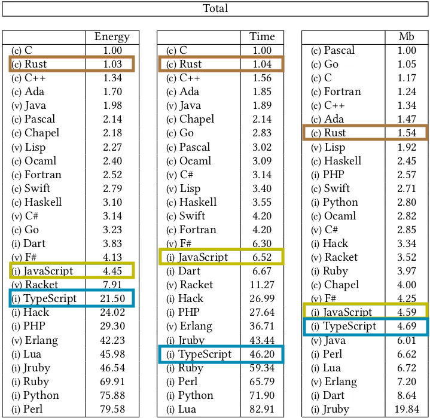

[](https://www.rust-lang.org/)

<br>

API Days Paris - Zacaria Chtatar - December 2023

https://havesome-rust-api-day.surge.sh

note:

Started dev and JS 10 years ago
And I love it
I love the fact that you can move quickly
The fact that you can use it everywhere
And that's the richest ecosystem ever

---

Forget TypeScript

Choose Rust to build

Robust, Fast and Cheap APIs

note:

But today I'm going to suggest you to

Forget Typescript

note:

It's not a tutorial, I'll try to give maximum elements to help guide your decision making.

I'll introduce you to Rust by being as less technical as possible.

---

<!--
## Typescript

- Dev UX

* Makes you forget that utimately it executes Javascript
* Makes you forget that it generates far more Javascript than you think
* Extensive type system which can block progression even if execution path is right
* Needs ecosystem support in order to not be a pain working with libraries
-->

<!-- --- -->


## Some context

note:

Why

----

2009 : it's jQuery era

Big brains decided to extract Chrome's JS VM to run JavaScript outside the browser

With this, they created JS modules systems

Suddenly, it became really easy to reuse and build upon JS code.

The abstraction was so powerfull that it created the FullStack developers.

But the fullstack Java, dotNet statically typed developers

Did not like the powerful JS yet dangerous JavaScript.

The feeling of safety was no more when wrote JS.

----

So TypeScript came as a superset. Bringing types, checks and refactor capabilities.

The greed, we can all be guilty of, can even let us build a complete typed sidesystem around our functionalities.

Costing time and effort just to please the compiler

Unfortunately, what TS brings fades just after the compilation.

Types, classes, interfaces are gone.

At 4am when problems occur, it's JS that we have to deal with.

----

NodeJs & NPM

- modules
- boom of easy to reuse code
- fullstack JS. Easy to start with, hard to master
- fullstack from backend guys don't want to learn JS

----

TypeScript

- OOP patterns
- compiler checks
- type system
- IDE Developer experience

<!-- 
**Discuss why there's a need to rethink the current approach to building APIs. ????** -->

----

## Pain points

- types disappear at runtime
- does not save from dealing with JS
- adds complexity
- no semver

<!-- Address the pain points with current technologies (like TypeScript). -->

** JSDoc is enough to get max value without overhead ** <!-- .element: class="fragment" data-fragment-index="1" -->

---

## New stakes, new needs

----

|Stakes|Needs|
|-------|-------|
|worldwide scale<br>privacy<br>market competition<br>environment<br><br>human lives|sclability<br>security<br>functionality <br>computation time<br>memory footprint<br>safety|

note:

space: memory footprint
time: execution speed, startup time
functionality: quantity of functionality, you need to refactor
security: quantity of bugs possible increase, and each failure or bug can impact millions

safety :  refers to the ability of a system to operate without causing harm or unintended consequences to people or the environment. It's about the system's internal behavior and its impact. The system needs to be fault tolerant
security : protecting systems from malicious attacks and unauthorized access. It's about external threats and the system's ability to defend against them.
---

## Introducing Rust

_Fast, Reliable, Productive: pick three._

---

## Stability

----


note:

When a value is unexpectedly null or undefined
That's an unvalid state
As a system programing language, Rust makes it easy to make invalid state unrepresentable

----

- compiled
- no GC
- memory management enforced by the compiler
- zero cost high level functions
- developed in Rust
- Bonus : devs level up

=> No blackbox between you and the machine
=> Predictability

note:

- compiled : so it produces a specific output for each architecture
- no GC : memory is managed via a deterministic system called Borrow checker
- no manual memory management by default: it's enforced by the compiler
- Developers do the memory management by themselves, but now are guided by the rules of the compiler
- zero cost high level functions like map or filter are compiled to the same output as imperative loops
- As a side effect, the high level languages devs get closer to the machine and get better at writing correct code

----

Borrow checker by default guarantees :

- No memory leaks
- No use-after-free
- No dangling pointers
- Runtime type system

----

What's wrong with this code ?

```ts
function readFile(path: string): string {
  return fs.readFileSync(path);
}
```

----

```rust
fn read_file(path: &str) -> Result<String, io::Error> {
    fs::read_to_string(path)
}
```

```rust
fn read_file(path: &str) -> String {
    fs::read_to_string(path).unwrap()
}
```

Make it clear of what could go wrong

----

2016 : Do you remember the [left-pad drama](https://qz.com/646467/how-one-programmer-broke-the-internet-by-deleting-a-tiny-piece-of-code) ?


[Source](https://www.explainxkcd.com/wiki/index.php/2347:_Dependency)

----

### crates.io

- no crate (package) unpublish
- can disable crate only for new projects

note:

cargo does not allow unpublishing
Instead it allows flagging packages and version to not be downloaded as new dependency

----

Linux: [Le Kernel](https://linux.developpez.com/actu/337316/Rust-for-Linux-est-officiellement-fusionne-le-support-initial-de-Rust-for-Linux-fournit-l-infrastructure-de-base-et-une-integration-elementaire/)


- 2/3 of vunerabilities come from memory management <!-- .element: class="fragment" data-fragment-index="1" -->
- Kernel is in C and Assembly <!-- .element: class="fragment" data-fragment-index="2" -->
- Linus Torvalds : ❌ C++ ❌ <!-- .element: class="fragment" data-fragment-index="3" -->
- attract young devs <!-- .element: class="fragment" data-fragment-index="4" -->

note:

For that I'll tell you that the Linux project which is looking for a new technology

To continue development after C, has started using Rust, as well as Microsoft for Windows

<!-- - Linux project
- [Microsoft](https://msrc.microsoft.com/blog/2019/07/a-proactive-approach-to-more-secure-code/) project -->

---

## Fast

----



note:

[Energy efficiency accross programing languages](https://greenlab.di.uminho.pt/wp-content/uploads/2017/10/sleFinal.pdf)

Energy measured using a framework (Computer Language Benchmarks Game) designed for running testing and comparing solutions to problems

And Intel's Running Average Power Limit (RAPL) tool which can measure energy consumption of an executed program.

----

#### Github: [Code Search index](https://github.blog/2023-02-06-the-technology-behind-githubs-new-code-search/)


45 million repos to index : <!-- .element: class="fragment" data-fragment-index="1" -->

- several months with Elasticsearch <!-- .element: class="fragment" data-fragment-index="2" -->
- 18h in Rust <!-- .element: class="fragment" data-fragment-index="3" -->

----

#### Clouflare: [HTTP proxy](https://blog.cloudflare.com/how-we-built-pingora-the-proxy-that-connects-cloudflare-to-the-internet/)


- nginx not fast enough 🤯 <!-- .element: class="fragment" data-fragment-index="1" -->
- hard to customize in C <!-- .element: class="fragment" data-fragment-index="2" -->
- allows to share connections between threads <!-- .element: class="fragment" data-fragment-index="3" -->

= 160x less connections to the origins <!-- .element: class="fragment" data-fragment-index="4" -->

= 434 years less handshakes per day <!-- .element: class="fragment" data-fragment-index="5" -->

----

#### Discord: [Message read service](https://discord.com/blog/why-discord-is-switching-from-go-to-rust)


- Cache of a few billion entries <!-- .element: class="fragment" data-fragment-index="1" -->
- Every connection, message sent and read... <!-- .element: class="fragment" data-fragment-index="2" -->
- latences toutes les 2 minutes en Go à cause du GC <!-- .element: class="fragment" data-fragment-index="3" -->

 <!-- .element: class="fragment" data-fragment-index="4" -->

note:

Thanks to no GC
Instead of stopping the world to clean unused memory
Every variable is cleaned at a precise moment
For the devs, that's the purpose of ownership

---

## Cheap

----


note:

- CPU and RAM consumption

- Less maintenance with less bugs

[Energy efficiency accross programing languages](https://greenlab.di.uminho.pt/wp-content/uploads/2017/10/sleFinal.pdf)

Energy measured using a framework (Computer Language Benchmarks Game) designed for running testing and comparing solutions to problems

And Intel's Running Average Power Limit (RAPL) tool which can measure energy consumption of an executed program.----

### AWS Lambda

- [Firecracker](https://firecracker-microvm.github.io/)

---

## Sexy

----

Rust is the most admired language according [SO](https://survey.stackoverflow.co/2023/#section-admired-and-desired-programming-scripting-and-markup-languages) for 8 years

When I go to JS meetups, lots of people speaking of Rust

People are motivated

note:

There currently a high entry barrier in this domain.

Most of Rust projects require senior C++ dev or risking yourself into volatile crypto projects

From my perspective that a good recruitment argument

As a more difficult than average technology
By recruiting Rust developers you get higher than average devs
Rust teachings can be used even outside of Rust projects

----

### It's a challenge

- It take 3 to 6 months to become productive

- It's not **that** hard

- Documentation was oriented towards C/C++ senior devs

note:

[Study](https://blog.rust-lang.org/2020/12/16/rust-survey-2020.html)

As a manager recruiting someone who successfully wen through the process of learning Rust

It's a safe bet in the technical aspect

----

- Compiled
- No GC
- No manual memory management : Ownership & Borrow checker
- developed in Rust

=> There is no blackbox between you and the machine

note:

developed in rust so you will always be able to know what happens inside

---

## TBD : Compiler 

- error messages and hints
- hight and low level : compilation with zero cost abstraction : example

note:

Being high and low level at the same time levels up the dev's skills
You learn how to think like a computer while writing expressive code

**It's like some fundamental problem has been solved**

---

### Tools

- cargo test : IT, UT
- cargo fmt
- cargo bench
- clippy : lint
- bacon : reload
- rust-analyzer : IDE developer experience

note:

cargo brings almost all the tools you need

There is no debate over which tool, or formatting standard to use


----

#### Cargo doc stays up to date

```rust [|6-7|]
/// Formats the sum of two numbers as a string.
///
/// # Examples
///
/// ```
/// let result = mycrate::sum_as_string(5, 10);
/// assert_eq!(result, "15");
/// ```
pub fn sum_as_string(a: i32, b: i32) -> String { (a + b).to_string() }
```

`cargo doc --open`

note:

coverage
executed during tests
keeps examples up to date

---

<!-- ## AI

When I started, Rust documentation was designed for C++ devs

- ChatGPT
- Copilot / Codeium
- [lets get rusty](https://www.youtube.com/@letsgetrusty/)

note:

Helps with functions discovery and paradigm -->

<!-- --- -->

## Governance

Rust Project

[Rust Foundation](https://foundation.rust-lang.org/)

Release process

Backward compatibility

Breaking changes are opt-in

note:

If code compiled at some point, it's guaranteed to compile later.

There's a [special project](https://github.com/rust-lang/crater) that runs a large number of packages to look for regressions in the compiler

Breaking changes are opt-in thanks to editions. The same version of Rust can compile different editions. Any crate can specify an edition.

---

<!-- # "How" -->

<!-- ---- -->

<!-- Slide: Rust in Action
Dive into how Rust addresses the pain points you've identified.
Discuss Rust's features like ownership, concurrency, and performance, and how they translate to better API development. -->

<!-- --- -->

<!-- Slide: Rust vs. TypeScript
Compare Rust with TypeScript, focusing on practical differences in API development scenarios. -->

<!-- --- -->

### "Benefits"

---

When it compiles, it runs <!-- .element: class="fragment" data-fragment-index="1" -->

correctly <!-- .element: class="fragment" data-fragment-index="2" -->

note:

It seems evident, but is it ?

What does correctly mean ?

- predictable : it always does what you expect it to do
- the error paths are handled or intentionnaly not handled
- secure
- scales


In terms of effort to make it correct
Everywhere else there's writing and proving are like 50/50
Proving includes Unit tests, Integration tests, with a QA.
Everything around the runtime which has to be taken care of but does not directly serve the user
The problem with TypeScript is that it gives the illusion you're now at 75/25 of writing vs running
But you're not.
TS lets you write code faster, but it's still 50/50

Most of the time it's ok, because we want to move fast. And the drawbacks are not that big
We just need to be aware of it.

So the compiler and the particular syntax checks a ton of problems

Slide: The Rust Advantage
Highlight the key benefits of using Rust – reliability, efficiency, and cost savings.

---

## Success Stories

Share case studies or examples where Rust has been successfully used to build robust APIs.

projects :
- [Discord](https://discord.com/blog/why-discord-is-switching-from-go-to-rust)
- Cloudflare
- Github
- [others](https://github.com/omarabid/rust-companies)

---

### Possible struggles

- Project moves slower
- It's an other paradigm
- Challenging to learn
- Build time

note:

Moving slower and safer for projects with high stakes, is not necessarily a bad thing when this ensures less bugs after release

It's a paradigm that really empowers developers even when using other languages. It touches fundamentals of software engineering

It was challenging to me. But lately I find more and more resources I wish I had when I started.
So today I feel like it's not that hard anymore. Espceially with ChatGPT and Copilot.
I'll leave some links in the end and you can come to me, or even leave a tweet if you're interested

---

### "When and Where"

----


[Source](https://www.youtube.com/watch?v=Wy-y75mMRg4)

note:

theo explains accurately that lots of projects starting don't know what they will look like in the end

So it's better to start using the most flexible tools in order to pivot easily.

Ability to find the product marker fit.

At this moment juste use flexible stacks like typescript and abstract problems using ready to go services

But when the projects finds its way, then the new need is performance and stability over flexibility

And Rust is perfect at this job

You can rewrite now and let it run for years without problems. And then come back with some new features

With the confidence that you won't break something unexpected.

---

### Get started as manager

- find dev interested in Rust: there are a lot
- start with simple projects:
  - CLI
  - lambdas
  - microservice
  - network app
  - devops tools

---

### Get started: as dev

- Books : official, google, lets get rusty

- [Rust book](https://doc.rust-lang.org/book/)
- [Rust by example](https://doc.rust-lang.org/stable/rust-by-example/)
- [Rustlings](https://github.com/rust-lang/rustlings)
- [Comprehensive Rust by Google](https://google.github.io/comprehensive-rust/)
- [fasterthanlime - A half-hour to learn Rust](https://fasterthanli.me/articles/a-half-hour-to-learn-rust)
- [Noboilerplate - Youtube](https://www.youtube.com/c/NoBoilerplate)
- [Code to the moon - Youtube](https://www.youtube.com/@codetothemoon/videos)
- [Roadmap](https://roadmap.sh/rust)

---

<!-- Show archi to go for

- REST : [axum](https://github.com/graphql-rust/juniper)
- GraphQl : [juniper](https://github.com/graphql-rust/juniper)
- ***

Slide: Getting Started with Rust
Offer guidance on when and where to start incorporating Rust into API development.
Provide resources for learning Rust and integrating it into existing projects. -->

<!-- --- -->

## TBD : Conclude with "Future Vision"

Slide: The Future of API Development
Paint a picture of the future where Rust plays a key role in API development.
Inspire your audience to be part of this future.

---

## Q&A

Slide: Open for Questions
Encourage audience engagement and address any queries or concerns.

---

## Conclusion

recap

Say again the main idea

---

### Thank you


